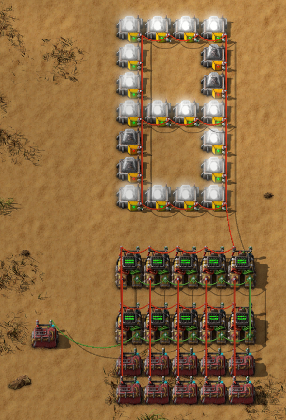
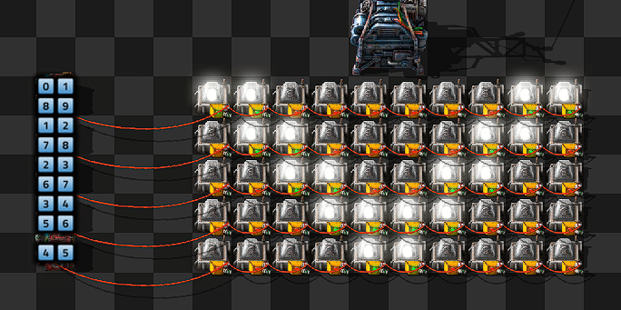
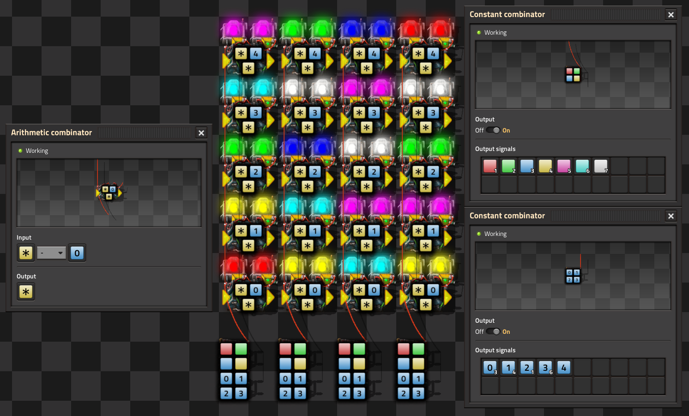
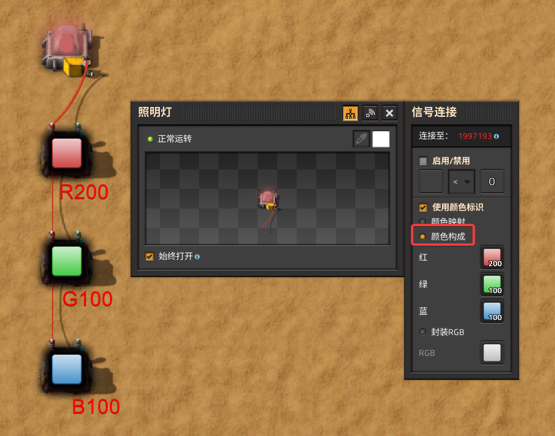

# factorio显示阵列

视频文件转为factorio显示阵列的蓝图，软件版本V2，V1各分量只支持1位色阶。

此项目使用python语言构建，使用opencv库缩放图像和读取像素值。

使用方法：

1. 取消播放器实体耗电属性。将`media_dev_0.0.2`目录复制到`%appdata%\Factorio\mods\`目录下，在factorio模组界面启用`Mdeia Dev`模组。
2. 修改`blueprint.py`文件`main`函数中的输入视频路径，运行程序，在系统剪贴板中生成对应的蓝图。视频帧数不要过高，否则使用蓝图时会非常卡顿，播放视频时帧率也不会很高。蓝图可以在地图模式中使用，将鼠标箭头放在工具栏，调整好地图位置和缩放后再移动鼠标确定蓝图建造。
3. 在软件中完成蓝图的构建后，手动启用时钟模块的常量运算器，等待一段时间后显示阵列开始播放视频序列。蓝图没有添加声音相关的器件，因此是无声的。


下面是实现原理，电路设计参考drawio文件。

## 不耗电模组

使用运算器搭建显示、音乐电路时需要搭建电线杆供电，影响显示效果，创建模组取消运算器的用电特性。

模组位于 `%appdata%\Factorio\mods`，其中的每个模组可以放文件夹，也是文件夹的压缩包。

模组开发参考

api文档https://lua-api.factorio.com/latest/

快速入门示例https://wiki.factorio.com/Tutorial:Modding_tutorial/Gangsir

要修改某一个物品，在https://wiki.factorio.com/中对应的界面找到 Prototype type和Internal name，进入api文档界面找到想改的属性进行修改。

目录结构

~~~
mods
└── media_dev_0.0.2
    ├── data.lua
    └── info.json
~~~

模组文件夹名称以版本号结尾，info.json中是基本数据信息，data.lua中是修改的数据。

info.json

~~~json
{
    "name": "media_dev",
    "version": "0.0.2",
    "title": "Media Dev",
    "author": "Xun",
    "factorio_version": "2.0",
    "dependencies": [
        "base >= 1.1"
    ],
    "description": "This mod change lamp, speaker and combinators to enery-free entities. And extend the wire connecting length for them."
}
~~~

data.lua

~~~lua
local ac=data.raw["arithmetic-combinator"]["arithmetic-combinator"]
ac.energy_source={type="void"}
ac.circuit_wire_max_distance=10000.0

local dc=data.raw["decider-combinator"]["decider-combinator"]
dc.energy_source={type="void"}
dc.circuit_wire_max_distance=10000.0

local cc=data.raw["constant-combinator"]["constant-combinator"]
cc.energy_source={type="void"}
cc.circuit_wire_max_distance=10000.0

local lamp=data.raw["lamp"]["small-lamp"]
lamp.energy_source={type="void"}
lamp.circuit_wire_max_distance=10000.0

local speaker=data.raw["programmable-speaker"]["programmable-speaker"]
speaker.energy_source={type="void"}
speaker.circuit_wire_max_distance=10000.0
~~~

保存文件后打开应用模组界面应该就可以看到新的模组了。

## 设定

1. 相同信号输入同一个运算器时，信号的值会相加，即使使用不同色的缆线也一样。
2. 一个运算器的输出可以直接连接输入进行反馈。
3. 运算器计算时会有时延，若运算器B的输入为运算器A的输入，则B的计算会在A的计算之后的tick中进行。

## 时间

1游戏秒由60tick组成，在计算机算力充足时，游戏帧率为60fps，算力吃紧时达不到60fps，1游戏秒要长于现实秒。游戏中每帧对应一个tick。

若要做一个可以输出当前游戏秒数的装置，可以将一个算术运算器的输出连接到自己的输入，输入输出的信号都是同一个，运算法则可以是输入信号加上数字0，再把一个常量运算器输出1个同样的信号连接到算术运算器的输入。这样的话算术运算器的输出就是一个不断增加tick值。把算术运算器的输出再连接到一个算术运算器中并除以60，就可以得到当前的秒数。


## 表示范围

在输入框输入正向数值与负向数值会被截断到-2.1G和2.1G，故使用的是**有符号32位整数**。

范围是0x8000 0000 到 0x7FFF FFFF，补码。

## 数字显示

[这里](https://wiki.factorio.com/Tutorial:Circuit_network_cookbook#Displays)展示了如何进行显示设置的基本流程。

下面展示的图中共有20个灯，每个常量运算器正好可以提供20个信号（软件版本2中放开了20个信号的限制）。

对每一个灯进行编号，对其指定一个信号与之关联，比如从上到下，从左到右分别指定信号[0]，信号[1]，...，信号[9]，信号[A]，信号[B]，...，信号[J]。每个灯的启用条件为对应信号大于数字0。下列的10个常量运算器保存着数字0-9的字型，比如数字1对应的常量运算器中保存着最右侧一列灯所对应的信号（对应数字1的字形），数字8对应的常量运算器中保存着所有灯对应的信号（[0]-[9] [A]-[J]）。最左侧的常量运算器中保存着一个另外的信号，用于筛选存储字型的常量运算器。此常量运算器的输出连接着10个比较运算器的输入，每个比较运算器的另一个输入分别连着一个字型常量运算器，启用条件是筛选用的常量运算器的输出和与之相连的字型常量运算器对应的数字相等，比较运算器的输出为所有信号，可以将需要点亮的灯所需的信号一起输送出去。虽然会额外输送出筛选运算器中的信号，但是这个信号与每个灯所需要的信号都不相同，所以不会产生影响。

将筛选常量控制器替换成上面生成当前秒数的装置，再构建几组不同的灯，对当前秒数进行除法和求余运算，就可以得到秒数的十位和个位，以及分钟和小时的十位和个位。

若要让分秒连接处的冒号每0.5秒闪烁一次，可以将tick除以30，将结果对2求余，得到的结果控制冒号的亮灭。



## 黑白屏显示



原理与上面的数字显示类似，左侧的常量运算器中保存其所在行需要点亮的每一个灯所对应的信号，每个灯的点亮条件为其对应的信号大于数字0。

若要实现动画效果，需要先保存每一个动画帧的画面，然后使用数字显示相同的方法，利用比较运算器根据时间进行筛选输出。

也可以在常量运算器中保存一个信号来实现这样的效果，使用信号的大小来控制所在行灯的亮灭。运算器中数字的类型为32位整型，每位可以控制一个灯。同时需要使用移位运算求解出每一个二进制位的数值，再把结果输出到灯上面。

更进一步，可以利用常量运算器的20个信号，每个信号的数值所占用的32个二进制位。可以将当前显示的帧序号除以20来选择当前存放数据的常量运算器，再将当前显示的帧序号对20取余来选择常量运算器中的每一个信号。信号选择完之后再经过移位计算获取每一个灯的显示状态。

不要每次移1位再将结果给下一个运算器进行移1位，而是每次直接从原始信号中直接移对应的位数。否则会有明显的时延效果。如果设定每帧显示时间足够长，且想要逐行扫描的效果，则可以尝试移1位串联的连接。

## 彩屏显示（V1）

颜色信号排序为红绿蓝黄品青白，灯按照此顺序显示第一个大于数字0的颜色信号。

| Color | R    | G    | B    | idx  |
| ----- | ---- | ---- | ---- | ---- |
| 红    | 1    | 0    | 0    | 0    |
| 绿    | 0    | 1    | 0    | 1    |
| 蓝    | 0    | 0    | 1    | 2    |
| 黄    | 1    | 1    | 0    | 3    |
| 品    | 1    | 0    | 1    | 4    |
| 青    | 0    | 1    | 1    | 5    |
| 白    | 1    | 1    | 1    | 6    |
| 黑    | 0    | 0    | 0    | 7    |

对于32位RGB色彩图像，每个通道取第一个二进制位即可。



这个图中的每两个相邻的灯可以看作一个灯，放两个灯是为了与和灯关联的计算运算器对齐。

右上角窗口中中保存7个颜色的常量运算器是固定的，右下角窗口是最后一列显示用的输入。信号[0] [1] [2] [3] [4]是固定的，表示从下到上的每一行。信号的大小为颜色值的序号，这里的序号与右上角颜色信号的大小值减1进行对应。每个计算着色器的运算为所有信号减去所在行号对应的信号。左侧窗口为最下面一行的运算器的运算方法。

右侧窗口显示的大小为1信号2表示，当前列（0开始）第2行灯的颜色的序号为（0开始）1，即右上角列表中的绿色。

颜色数组中每个信号的大小是依次加1的，每个信号减去绿色所在的序号，则绿色前面信号的大小都会小于1，绿色及其后的信号都会大于等于1，并且由于红绿蓝黄品青白的显示顺序，所以便会灯便会显示绿色。

如果需要将灯熄灭，则可以将信号大小设定为7，相减后的差值都不会大于0。

当有多个运算器接入显示阵列，有多条线缆经过同一处时，接线使用竖向接线而不要使用横向接线，因为横线接线时线缆有下坠效果，不同距离接线下坠显示不同，多条线缆时会遮住灯光的显示。

可以对输入的图像进行压缩来节约常量运算器的数目。每个常量运算器有20个信号，每个信号大小占二进制位为32，颜色编号为0到7可以使用3个二进制位表示。每个信号可以保存32/3=10个像素颜色值，所以一个常量运算器可以存储10*20=200个像素颜色值。对于解码，每个像素需要一个移位和位与运算器拿出颜色编号，需要一个相减运算器输出正确的颜色信号。

## 彩屏显示（V2）

factorio 版本2增强了灯的显示属性，在上一个版本中只能显示给定的红绿蓝黄品青白加上关闭共8种状态。现在添加了RGB控制，可以使用3个信号分别控制RGB的强弱或使用混合在一起的RGB值来控制灯的色彩。由于显示色阶的提升，原来只需要3个二进制位就可以表示灯的颜色，现在需要24个二进制位才能完成表示。



24个位来表示一个颜色太奢侈，不使用DCT等复杂的图像压缩算法，直接在时域通过删除图像构成RGB中的小的分量，只保留其最主要的部分，进而完成图像压缩。

以十进制类比，如果数字的位数是5，最高为万位，存储时只保留万位和千位，便可将存储位数从5位降为2位。假设需要保存的数字是12854，则保存下来的数则为12000。

对于颜色值，程序中使用的是RGB值，每个分量占8位。将此种表示方法记为R8B8G8，压缩后的颜色表示方法为R3G3B2。其中B值不为3是因为1字节有8位。（相对其它2个颜色，人眼对蓝色较不敏感？RGB转灰度公式：0.2989 * R + 0.5870 * G + 0.1140 * B。）

编码后的颜色丢失低位信息，因此无法达到各分量的最高值，画面颜色偏暗。将颜色各分量的值乘以0b11111111再除以0b11100000，使其分布均匀。为简化解码器，蓝色分量也使用相同的方法。线性映射后，红绿分量可以达到最高值255，而蓝色分量的最高值是218。映射时先乘后除，因为运算器不支持小数。

## 编码

一个信号使用4个字节的整数表示信号大小，在信号大小中存储颜色信息。一个像素3个分量共占1个字节。因此一个信号可以保存4个像素信息。

4个像素为一组，对组内每个像素的各个分量取3或2个最高有效位，然后将取到的数值不重叠放进一个整数的各个二进制位中。

$$(R \& 0\rm{b}11100000) | ((G \& 0\rm{b}11100000) >> 3) | ((B \& 0\rm{b}11000000) >> 6)$$

上面得到的是一个8位的整数，将4个像素得到的4个整数打包进一个数据中，放到一个信号的大小中。

## 解码

取出常量运算器中的信号的大小，直接将每一个颜色每一个分量的值右移到最低的字节最高位处，其它位置0即可取出解码后的值。将解码后的值接入一个乘法器再接入一个除法器以完成颜色范围的线性映射。

不需要再将解码出来的RBG分量值再组合到成一个数值输出给灯，1是因为灯可以直接接收各分量，2是因为组合的时候可能会有时序问题，即组合时各分量走的路线不一样长，导致下一帧的分量与上一帧的分量进行了组合，不过未验证是否真的会存在此问题。

## 灯设置

灯设置为常量，不然白天时不亮。

灯的默认颜色设置为0x000000，系统默认的是白色0xffffff。当输入信号的RGB分量都为0时，系统会认为没有信号输入，从需使用默认颜色，而不是真正需要不发光。

## 实体接线

显示阵列以列为基本单位，因为行主序的话接线后线会把灯给挡住。

列主序时注意运算器与灯接线时要从运算器右侧与灯相连，因为灯的接线在右边。从运算器左侧接线的话同样会有灯被遮挡的问题。

## 蓝图

导出一个蓝图，结果为字符串格式。

[这里](https://wiki.factorio.com/Blueprint_string_format)给出了解码方法。

```shell
echo "$blueprint_string" | cut -c2- | base64 -d | pigz -d
```

上面的命令表示删除字符串开头的第1个字符（版本号），再使用base64解码，最后使用pigz解压缩。

### 蓝图框架

~~~json
{
    "blueprint": {
        "icons": [
            {
                "signal": {"name": "decider-combinator"},
                "index": 1
            }
        ],
        "entities": [],
        "wires": [],
        "item": "blueprint",
        "version": 562949954732035
    }
}
~~~

其中的entities为各个组件实体，wires为前面描述过的接线方式。

### 灯

~~~json
{
    "entity_number": 1,
    "name": "small-lamp",
    "position": {
        "x": 26.5,
        "y": -108.5
    },
    "control_behavior": {
        "use_colors": true,
        "color_mode": 1
    },
    "color": {
        "r": 0,
        "g": 0,
        "b": 0,
        "a": 1
    },
    "always_on": true
}
~~~

坐标x轴方向向右，y轴方向向下。

### 常量运算器

~~~json
{
    "entity_number": 1,
    "name": "constant-combinator",
    "position": {
        "x": 26.5,
        "y": -108.5
    },
    "control_behavior": {
        "sections": {
            "sections": [
                {
                    "index": 1,
                    "filters": [
                        {
                            "index": 1,
                            "type": "virtual",
                            "name": "signal-A",
                            "quality": "normal",
                            "comparator": "=",
                            "count": 100
                        }
                    ]
                }
            ]
        }
    }
}
~~~

这里启用了一个编组，其中放了一个值大小为100的A信号。

### 判断运算器

~~~json
{
    "entity_number": 1,
    "name": "decider-combinator",
    "position": {
        "x": 30.5,
        "y": -111
    },
    "control_behavior": {
        "decider_conditions": {
            "conditions": [
                {
                    "first_signal": {
                        "type": "virtual",
                        "name": "signal-dot"
                    },
                    "constant": 50,
                    "comparator": "=",
                    "first_signal_networks": {
                        "red": true,
                        "green": false
                    }
                }
            ],
            "outputs": [
                {
                    "signal": {
                        "type": "virtual",
                        "name": "signal-everything"
                    },
                    "networks": {
                        "red": false,
                        "green": true
                    }
                }
            ]
        }
    }
}
~~~

这里的运算器在红色输入端收到的点信号值等于50时，会将绿色输入端的信号全部输出，红绿输出端都会进行输出。

### 算术运算器

~~~json
{
    "entity_number": 1,
    "name": "arithmetic-combinator",
    "position": {
        "x": 25.5,
        "y": -108
    },
    "control_behavior": {
        "arithmetic_conditions": {
            "first_signal": {
                "type": "virtual",
                "name": "signal-A"
            },
            "second_constant": 255,
            "operation": "AND",
            "output_signal": {
                "type": "virtual",
                "name": "signal-red"
            }
        }
    }
}
~~~

这里的运算器会将红绿输入的信号A的值相加，然后值为相加之和的红信号。

### 接线

~~~json
{
    "wires": [
        [1, 1,
         2, 1],
        [2, 1,
         3, 1]
    ]
}
~~~

1个方框号中的4个数值表示连接的2个对像，第1、3位表示连接实体的id，第2、4位表示接线位置。1表示输入红，2表示输入绿，3表示输出红，4表示输出绿。如果只有两个接线，则1表示红，2表示绿，没有3和4。

